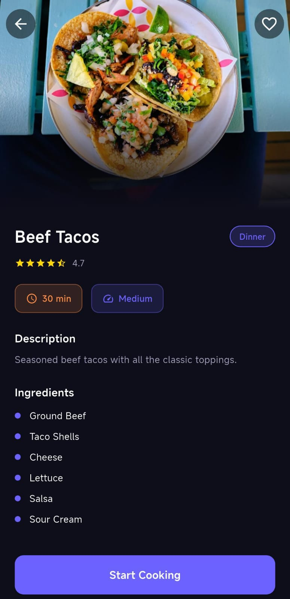
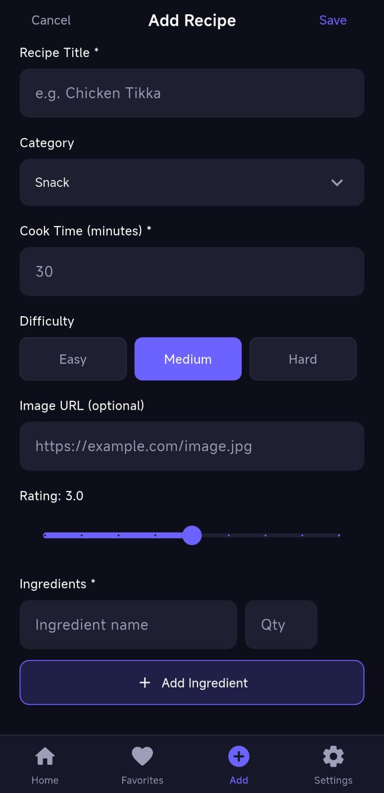
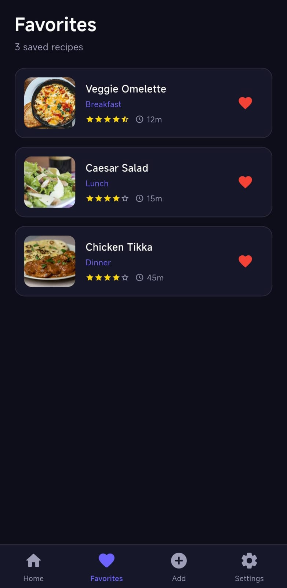
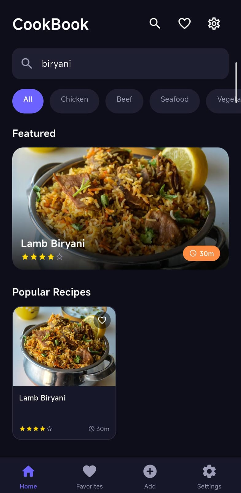

# CookBook
A recipe management app built with Flutter featuring a dark UI, smart search, live recipes from TheMealDB API, and full recipe management across 5 screens.

[](https://flutter.dev)
[](https://dart.dev)
[](https://flutter.dev)

---

## Screenshots

| Home | Recipe Detail | Add Recipe |
|------|--------------|------------|
|  |  |  |

| Favorites | Settings | Search |
|-----------|----------|--------|
|  |  |  |

---

## Features

| Screen | Description |
|--------|-------------|
| Home | Live recipes from TheMealDB API, featured hero card, category filters, 2-column recipe grid, real-time search |
| Recipe Detail | Full ingredients list from API, difficulty chip, cook time, start cooking CTA, favourite toggle |
| Add Recipe | Form validation, difficulty selector, dynamic ingredients list, saves to favourites |
| Favorites | Persisted across sessions via SharedPreferences, empty state UI |
| Settings | Dark theme, notifications, auto sync, clear all data |

---

## Getting Started
```bash
# Clone the repo
git clone https://github.com/emannoor-cs/CookBook_FlutterApp.git

# Install dependencies
flutter pub get

# Run the app
flutter run
```

**Platforms**
```bash
flutter run -d android
flutter run -d chrome
flutter run -d windows
```

---

## Project Structure
```
lib/
├── main.dart
│   ├── AppColors              # Color tokens
│   ├── MainNavigation         # Bottom nav shell
│   ├── HomeScreen             # Search, filters, API recipe grid
│   ├── RecipeDetailScreen     # Full recipe view
│   ├── AddRecipeScreen        # Recipe creation form
│   ├── FavoritesScreen        # Saved recipes
│   └── SettingsScreen         # Preferences
├── providers/
│   └── recipe_provider.dart   # ChangeNotifier — API state + favorites
└── services/
    └── meal_service.dart      # TheMealDB API calls
```

---

## Tech Stack

- **Framework:** Flutter 3.x
- **Language:** Dart 3.x
- **State Management:** Provider (ChangeNotifier)
- **API:** [TheMealDB](https://www.themealdb.com/api.php) — free recipe database
- **Local Storage:** SharedPreferences — favorites persist across sessions

## Packages

| Package | Version | Purpose |
|---------|---------|---------|
| [provider](https://pub.dev/packages/provider) | ^6.1.2 | State management |
| [http](https://pub.dev/packages/http) | ^1.2.0 | REST API calls |
| [shared_preferences](https://pub.dev/packages/shared_preferences) | ^2.3.2 | Local favorites storage |

---

## Author

**Eman Noor**  
[](https://github.com/emannoor-cs)
