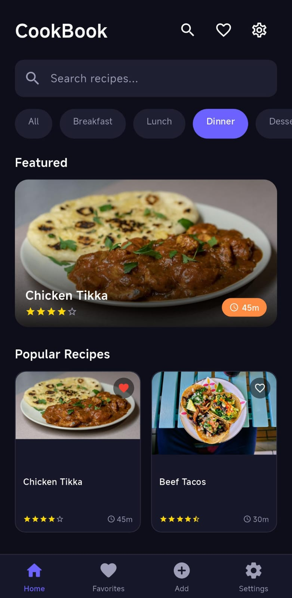
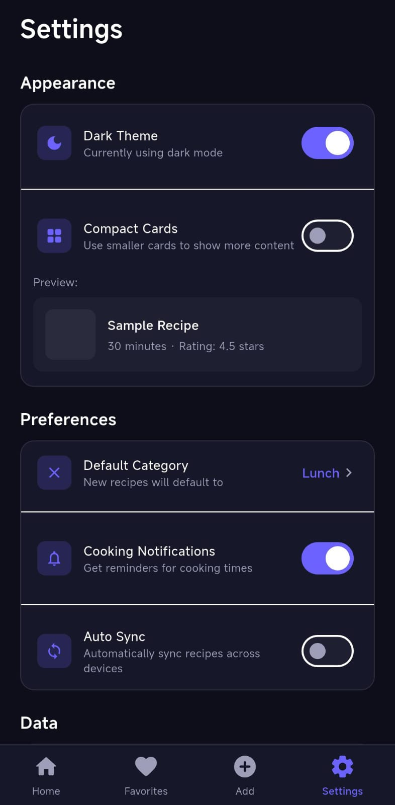

# CookBook

A recipe management app built with Flutter featuring a dark UI, smart search, and full recipe management across 5 screens.

[](https://flutter.dev)
[](https://dart.dev)
[](https://flutter.dev)
[](LICENSE)

---

## Screenshots

| Home | Recipe Detail | Add Recipe |
|------|--------------|------------|
|  |  |  |

| Favorites | Settings |
|-----------|----------|
|  |  |

---

## Features

| Screen | Description |
|--------|-------------|
| Home | Featured hero card, category filters, 2-column recipe grid |
| Recipe Detail | Ingredients, difficulty chip, cook time, start cooking CTA |
| Add Recipe | Form validation, difficulty selector, dynamic ingredients list |
| Favorites | Save and manage favorite recipes with empty state |
| Settings | Dark theme, notifications, auto sync, data export/import |

---

## Getting Started

```bash
# Clone the repo
git clone https://github.com/emannoor-cs/CookBook_FlutterApp.git

# Install dependencies
flutter pub get

# Run the app
flutter run
```

**Platforms**

```bash
flutter run -d android
flutter run -d chrome
flutter run -d windows
```

---

## Project Structure

```
lib/
└── main.dart
    ├── AppColors              # Color tokens
    ├── MainNavigation         # Bottom nav + shared state
    ├── HomeScreen             # Search, filters, recipe grid
    ├── RecipeDetailScreen     # Full recipe view
    ├── AddRecipeScreen        # Recipe creation form
    ├── FavoritesScreen        # Saved recipes
    └── SettingsScreen         # Preferences
```

---

## Tech Stack

- **Framework:** Flutter 3.x
- **Language:** Dart 3.x
- **State Management:** setState
- **Packages:** None — pure Flutter

---

## License

MIT License — free to use, modify and distribute.

---

<div align="center">
  <sub>Give it a star if you found it useful!</sub>
</div>
